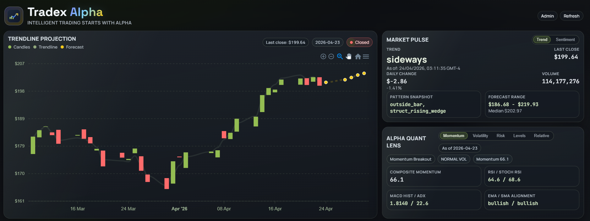
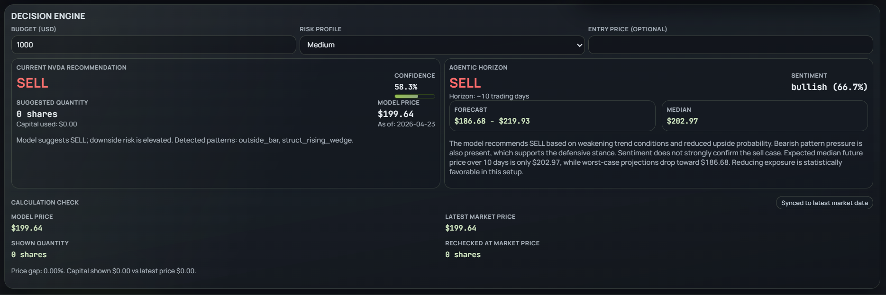
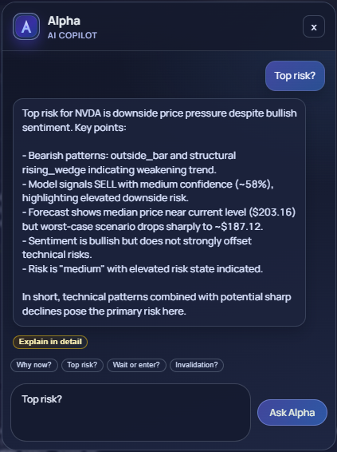

#  Tradex Alpha

AI-powered swing trading dashboard for **NVDA** with technical signals, sentiment, probabilistic forecasting, quant risk metrics, and an LLM copilot (**Alpha**).

**Live Demo:** https://tradexalpha.vercel.app/  
_Note: Initial loading may take some time due to heavy backend processing and cold starts._

## Overview
Tradex Alpha combines:
- ML classification (`BUY` / `HOLD` / `SELL`)
- Pattern-aware agentic horizon forecasting
- Sentiment intelligence
- Quant insight modules (momentum, volatility, risk, levels, relative strength)
- LLM-assisted explanation and Q&A



## Core Features
- **Trendline Projection chart** with candles, trendline, and short-horizon forecast overlay
- **Market Pulse** panel (trend/sentiment toggle)
- **Decision Engine** (recommendation + agentic horizon)
- **Alpha Quant Lens** (single-card switched metrics)
- **Alpha chat assistant** for contextual trade Q&A
- **Admin & System Status** modal (scheduler, refresh timestamps, model version, heartbeat)
- **Animated full-screen market loader** for startup/hard refresh, with inline background refresh states
- **Vercel Web Analytics** integration for traffic/page insights



## Alpha - AI Copilot
Alpha is the built-in conversational trading copilot designed to explain the platform's signals in clear, user-friendly language.

### What Alpha does
- Answers context-aware questions using live dashboard context (trend, signal, sentiment, quant metrics)
- Uses a teaching-style tone to explain trade logic, risks, and invalidation conditions
- Supports a two-step response flow:
  - **Fast mode** for quick, concise guidance
  - **Explain in detail** follow-up for deeper reasoning on the same question
- Reuses the same user query when **Explain in detail** is clicked, and runs a richer deep-analysis response



## Tech Stack
### Frontend
- React 19 + TypeScript
- Vite
- ApexCharts (`react-apexcharts`)
- Axios
- Vercel Analytics (`@vercel/analytics`)

### Backend
- FastAPI + Uvicorn
- scikit-learn + joblib (model inference/training)
- pandas + numpy
- requests/httpx
- python-dotenv
- Supabase client integration (optional but supported)

## Quick Start (3 Minutes)
```powershell
# 1) Backend
python -m venv .venv
.\.venv\Scripts\Activate.ps1
pip install -r requirements.txt
cd backend
uvicorn src.api.main:app --reload --host 0.0.0.0 --port 8000
```

```powershell
# 2) Frontend (new terminal)
cd frontend
npm install
npm run dev
```

Open:
- Frontend: `http://localhost:5173`
- Backend: `http://localhost:8000/api/ping`

Note: create `backend/.env` before production-like runs (see Environment Variables section below).
Demo admin access: use password `test-admin` to open Admin & System Status and inspect scheduler health, refresh timestamps, model version, and recent events.

Current symbol support is NVDA-focused in API routes and UI.

## Project Structure
```text
backend/
  src/
    api/                 # FastAPI routes (nvda, llm, admin, app bootstrap)
    services/            # runtime orchestration, refresh scheduler, recommendation
    data/repositories/   # market, sentiment, admin status, persistence adapters
    integrations/        # Alpaca client
    orchestration/       # analysis pipeline graph + nodes
    quant_engine.py      # quant metrics and composite insights
    signal_engine.py     # classifier recommendation engine
    agent_engine.py      # agentic horizon + forecast logic
  models/               # trained model artifacts
  data/                 # historical/source datasets

frontend/
  src/
    App.tsx             # main dashboard layout + interactions
    App.css             # theme + responsive styles
    api.ts              # typed API client
```

## Local Setup
### 1) Prerequisites
- Python 3.11+
- Node.js 18+
- npm

### 2) Backend setup
From project root:
```powershell
python -m venv .venv
.\.venv\Scripts\Activate.ps1
pip install -r requirements.txt
```

Create backend env file:
```powershell
Copy-Item backend/.env backend/.env.local -ErrorAction SilentlyContinue
```
(Or create `backend/.env` directly with the variables below.)

Run backend:
```powershell
cd backend
uvicorn src.api.main:app --reload --host 0.0.0.0 --port 8000
```

### 3) Frontend setup
In a new terminal:
```powershell
cd frontend
npm install
npm run dev
```

Default frontend dev URL: `http://localhost:5173`

Backend base URL in frontend client: `http://localhost:8000`

## Environment Variables (`backend/.env`)
Minimum useful set:

```env
# LLM
OPENAI_API_KEY=
OPENAI_MODEL=gpt-4.1-mini

# Alpaca
ALPACA_API_KEY=
ALPACA_SECRET_KEY=
ALPACA_BASE_URL=https://paper-api.alpaca.markets
ALPACA_DATA_URL=https://data.alpaca.markets
ALPACA_STOCK_FEED=sip
ALPACA_FALLBACK_TO_IEX=true

# Supabase (optional but recommended)
SUPABASE_URL=
SUPABASE_ANON_KEY=
SUPABASE_SERVICE_ROLE_KEY=
SUPABASE_MODELS_BUCKET=models
SUPABASE_MODEL_METADATA_BUCKET=model-metadata
SUPABASE_DATASETS_BUCKET=datasets

# Runtime / scheduler
LANGGRAPH_ENABLED=false
AUTO_REFRESH_ENABLED=true
MARKET_REFRESH_INTERVAL_SECONDS=900
SENTIMENT_REFRESH_INTERVAL_SECONDS=1200
MODEL_RETRAIN_ENABLED=true
MODEL_RETRAIN_INTERVAL_SECONDS=14400

# Admin
ADMIN_PANEL_PASSWORD=test-admin
```

## API Reference (selected)
Base: `http://localhost:8000`

### Health
- `GET /` - home payload
- `GET /api/ping` - service status

### NVDA Analysis
- `GET /api/nvda/candles?limit=120`
- `GET /api/nvda/current_trend`
- `GET /api/nvda/sentiment`
- `GET /api/nvda/latest_signal?budget=1000&risk=medium`
- `GET /api/nvda/agentic_signal?budget=1000&risk=medium&entry_price=206`
- `GET /api/nvda/analyze?budget=1000&risk=medium&limit=120&entry_price=206&persist=true`

### LLM
- `POST /api/llm/observe`
- `POST /api/llm/trade_question`
  - Supports `mode: "fast" | "deep"` for concise vs detailed Alpha responses

### Admin
- `POST /api/admin/login`
- `GET /api/admin/status` (requires `x-admin-password`)
- `POST /api/admin/refresh_all` (requires `x-admin-password`)
- `POST /api/admin/retrain_model` (requires `x-admin-password`)
- `POST /api/admin/sync_market_data` (requires `x-admin-password`)
- `POST /api/admin/sync_sentiment` (requires `x-admin-password`)

## UI Notes
- **Decision Engine**: recommendation + confidence + horizon + forecast summary
- **Alpha Quant Lens**: switched tabs for Momentum, Volatility, Risk, Levels, Relative
- **Recent Pattern Signals**: compact edge-to-edge strip
- **Loader**: full-screen animated market graph during major loading states

## Deployment
### Frontend (Vercel)
Recommended root for Vercel: `frontend/`
- Build command: `npm run build`
- Output directory: `dist`

If backend URL differs in production, update API base handling in `frontend/src/api.ts`.

### Backend
Deploy to any Python host (Render, Railway, Fly.io, VM, etc.) with:
- `pip install -r requirements.txt`
- `uvicorn src.api.main:app --host 0.0.0.0 --port $PORT`

Set required env vars in provider dashboard.

## Security and Repo Hygiene
- Never commit `backend/.env`.
- Avoid committing runtime logs and local cache artifacts (`__pycache__`).
- Model binaries (`.pkl`) can be large/noisy; consider release artifacts or object storage.

## Troubleshooting
- **"Failed to load data from backend"**: ensure backend is running on port 8000.
- **Data appears stale or panels fail intermittently**: open the Admin & System Status panel (password `test-admin` in demo setup) and verify scheduler status, market/sentiment refresh timestamps, and recent admin events.
- **Admin status timezone confusion**: timestamps are stored in UTC; UI formats to local timezone.
- **Git push auth issues**: use GitHub PAT or authenticated GitHub CLI.
- **Model warnings (sklearn version mismatch)**: retrain/export model using the current sklearn runtime.

## Branding
- Site: **Tradex Alpha**
- Copilot: **Alpha**

---
Developed by Hrishik Desai
